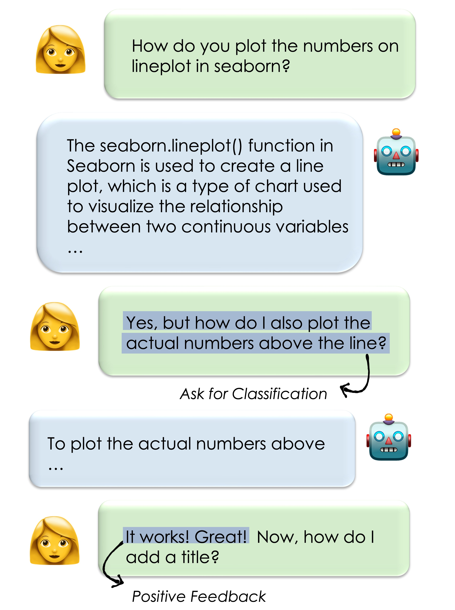

# Learning from Naturally Occurring Feedback

<p align="center">
  
</p>

Human feedback data is a critical component in developing language models. 
However, collecting this feedback is costly and ultimately not scalable.

In the [paper](https://arxiv.org/pdf/2407.10944) we propose a scalable method for extracting feedback that users naturally include when interacting with chat models, 
and leveraging it for model training. 

This repo contains the code for feedback extraction, and for using the already extracted feedback data from the paper.


Citiation
---
If you find this work useful, please cite our paper:

```
@misc{donyehiya2024learningnaturallyoccurringfeedback,
      title={Learning from Naturally Occurring Feedback}, 
      author={Shachar Don-Yehiya and Leshem Choshen and Omri Abend},
      year={2024},
      eprint={2407.10944},
      archivePrefix={arXiv},
      primaryClass={cs.CL},
      url={https://arxiv.org/abs/2407.10944}, 
}
'''
